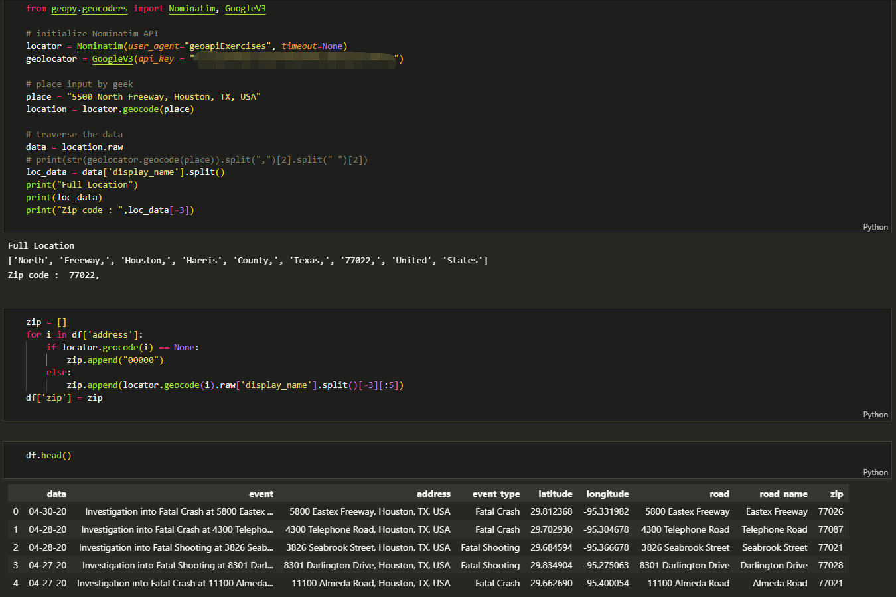

 

# Web Scraping fatal events reports from HPD official website, ETL and visulation using Tableau

## Table of Contents

- [Web Scraping fatal events reports from HPD official website, ETL and visulation using Tableau](#web-scraping-fatal-events-reports-from-hpd-official-website-etl-and-visulation-using-tableau)
  - [Table of Contents](#table-of-contents)
  - [1. Web Scraping](#1-web-scraping)
  - [2. ETL](#2-etl)
    - [2.1 Extract address from reports](#21-extract-address-from-reports)
    - [2.2 Get longtitude and latitude from address](#22-get-longtitude-and-latitude-from-address)
    - [2.3 Get zip code from address](#23-get-zip-code-from-address)
  - [3. Use Tableau to visualize](#3-use-tableau-to-visualize)
  - [Contact](#contact)

## 1. Web Scraping

Houston Police department official site has information about fatal events including fatal crash and fatal shooting every month. The webpage looks like this:

 
<em>Houston Police Department, Office of Community Affairs</a> on <a href="https://www.houstontx.gov/police/news.htm">(https://www.houstontx.gov/police/news.htm)</a></em>

The website also provides monthly archives. Using python library BeautifulSoup, I scrapped the information and save it as a pandas data frame.

 
<em>Web scraping using python library BeautifulSoup</a></a></em>

## 2. ETL

### 2.1 Extract address from reports

 
<em>Extract address from reports and filter out other types of events</a></a></em>

### 2.2 Get longtitude and latitude from address

Using geopy and geopandas python library, got the latitude and longtitude for each address.

 
<em>Got the latitude and longtitude use geopy and geopandas</em>

### 2.3 Get zip code from address

 
<em>Image by Author</em>

## 3. Use Tableau to visualize
Now i have the data frame i need, next step is Tableau.

 
<em>Visulize the fatal events on Tableau map</a> on <a href="https://public.tableau.com/app/profile/wei.zhang5193/viz/FatalHouston/Map">(https://public.tableau.com/app/profile/wei.zhang5193/viz/FatalHouston/Map)</a></em>

 
<em>Data analytic on Tableau online</a> on <a href="https://public.tableau.com/app/profile/wei.zhang5193/viz/Fatal_Houston_Stats/Dashboard">(https://public.tableau.com/app/profile/wei.zhang5193/viz/Fatal_Houston_Stats/Dashboard)</a></em>

## Contact

- **Author**: Wei Zhang
- **Email**: [zwmc@hotmail.com](zwmc@hotmail.com)
- **Github**: [https://github.com/vveizhang](https://github.com/vveizhang)
- **Linkedin**: [https://www.linkedin.com/in/wei-zhang-76253523/](https://www.linkedin.com/in/wei-zhang-76253523/)
